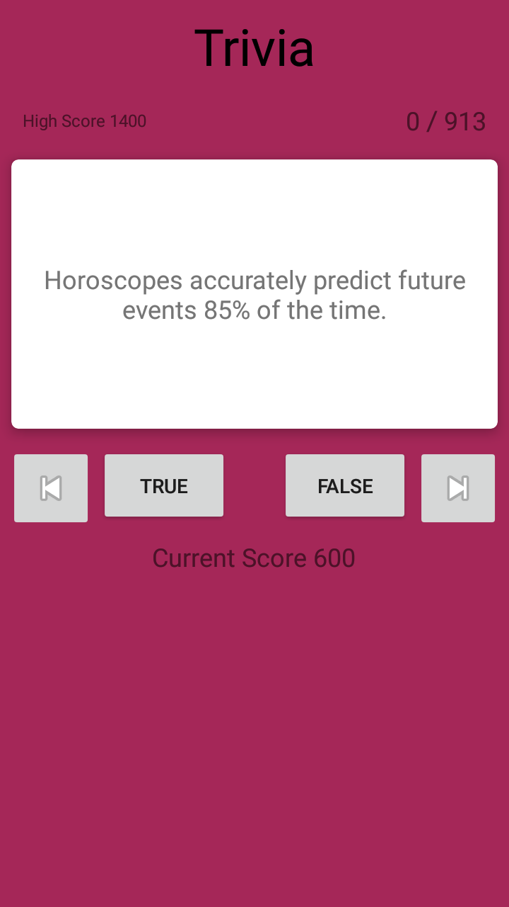
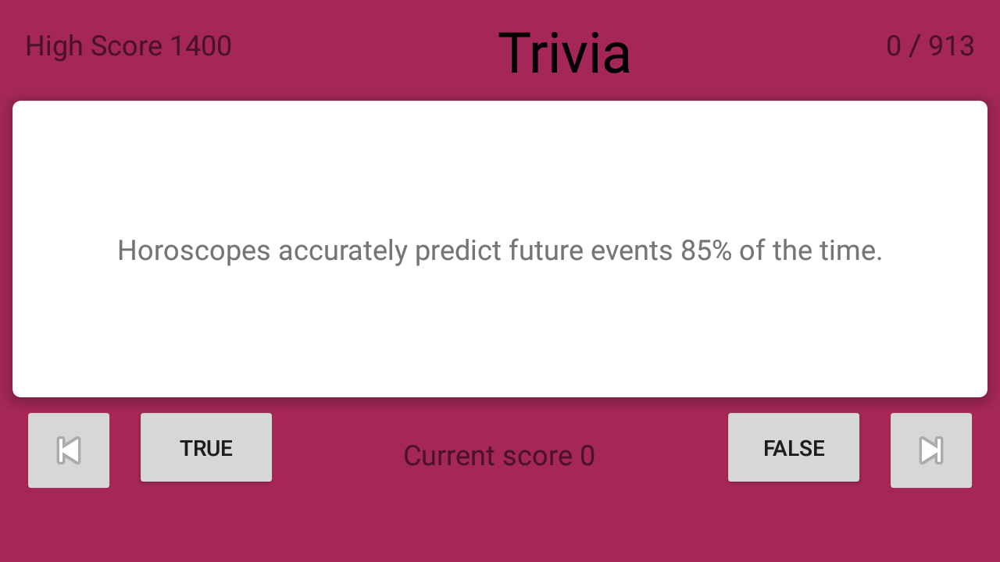

# Android 

## Java Based Android Development

Hey I'm Wes and this is where I do my Android apps, It's kinda like you are lookng directly on my computer, whoa. Don't worry I'll help you find the right app for you. I really reccomend the Trivia app. To work on these projects and compile them you will require Android Studio. If you would like to try one of my apps there is a list which gives you information on whether or not the app requires any special permissions such as internet or storage. To install the apps you will need to allow unknown sources on your device because these apps are in development and, as such are considered to be in debug mode. The Triva is app is the closest I have gotten to making a game.

## Screen shots

# Reccomeneded Settings and tools

Android Studio - 3.5.3 
Java version - openjdk 11.0.4 64-Bit 
SDK tools - 29+ 
Google Play Services 49+ 
Virtual devices - Nexus 5:api 24, Pixel:api 27 
Minumum API - 19 (95% coverage of all devices) 

# Current Project

1. Baby Needs
2. Test

# Releases -- Permissions

1. ListApp -- None
2. LoginLogout -- internet
3. Parse -- internet
4. MakeItRain -- None
5. Quiz -- None
6. Triva -- internet

## Notes

10/29/19 -- For easy install download ListApp_1.0.apk [here](www.website.com).

10/29/19 -- LoginLogout requires internet permissions and is unsigned. Cannot log out yet. That is coming next along with creating an account.

10/30/19 -- Implemented a process for users to create an account with an email and password. There is a button to sign out. User data and credentials are stored in Google's Firebase near real-time database for persistence. See comments in Main_Activity.java for notes on the process as well as relating files and methods used.

11/03/19 -- added a user account to be stored with firebse/Firestore in the future.

11/06/19 -- I've hit trouble with trying to get a download link. This is day three of trying to figure out the process. I thinking I need to use an OnCompleteListner() and then follow up with an OnCompleteListener() in the StoreData method that will be declared. Right now the code works but, the final output is not as expected. I want to be able to store the data in the cloud.

11/08/19 -- Syntatx wise the code works. I have implemented the code that is needed for a sucessfull download of the image for the most part. I know some of it is still broken. I still have a bit more work to do until I can move forward.

11/11/19 -- The structures are correct and I have enhanced the code for catching errors. The project builds and I get an uploading  dialogue. I had one error and worked through it. Things are looking good just need to get everything in order and I'll be able to move on.

02/05/20 -- LoginLogout is broken. People can still create an account with email or login but, you cannot save to the cloud storage. The 
process is broken and not working for the current version of Android and the projet has been abandoned. I've since released QuizApp, Trivia,
ActivtyLifeCycle, Parse, and I'll be releasing a new project soon. There are new README's all through out and there is a restructure in 
the works to clean up the repo. I'll be coming back around for FireStore in the future.

02/10/20 -- Triva is an app which utilizes the Volley Library to handle Json api calls. There are quite a few variations completed for people to try. Triva_1.0 utilizes Toast messages to confirm if the answer is correct or incorrect similar to the Question app I created. Triva_1.1 uses a shake animation and opacity animation while changing the CardView colors, green for correct and red for wrong. The Toast messages were still in place. Triva_1.2 finaly introduces the SharedPreference class which allows for saving of data locally on the device. The high score is saved when someone quits the app. 

02/14/20 -- Contact Manager 1.0 is a single table sqlite3 app that is completely logcat based. Contact Manager 1.1 will have a ListView to display entries in the data base. Added some screen shots to improve the readme.

02/19/20 -- The ListView variation of Contact Manager is complete. Updated
QuickLauncher with a background and refactored the code. The RecyclerView 
version of Contact Manager is almost complete. Drew in a background to enhance
the visuals. All in All RecyclerView layouts are a lot more involved than
ListViews but, very rewarding in terms of visuals and customization options.

02/21/20 -- removed Contact Manager from releases as it is not possible to
populate the RecyclerView from the db once on a Physical device. A Todo app is
coming soon. Test is a playground app where I test all of my skills up to this
point. More changes coming soon. Maybe I'll be able to get the DreamKeeper app
working at this rate.
